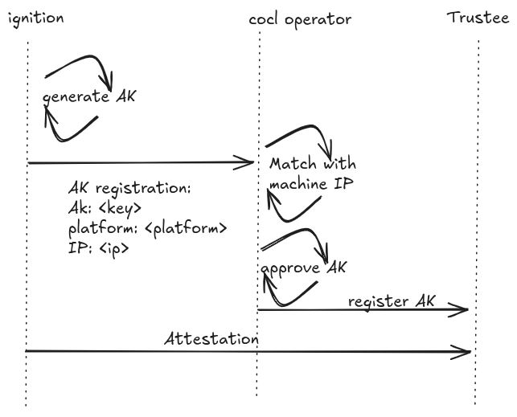

## Overview

This document describes the attestation key (AK) registration process for confidential clusters. The AK is provisioned and registered during first boot using Ignition's attestation support. The registered AK follows a Trust On First Use (TOFU) model, where the key is trusted upon initial registration and subsequently used by Trustee to verify attestation reports.

## Attestation Key Overview

The **Attestation Key (AK)** is a TPM-based cryptographic key used to sign attestation reports. It serves as the node's cryptographic identity in the attestation process:

- **Generation**: Created once during firstboot and stored persistently in the TPM
- **Purpose**: Signs attestation quotes that prove the node's platform state
- **Trust Model**: TOFU - trusted when first registered, used to verify all subsequent attestations
- **Persistence**: Stored at `/var/tpm/ak.pub` to prevent regeneration on subsequent boots

## TOFU (Trust On First Use) Model

The TOFU model simplifies the attestation workflow by establishing trust during the initial registration:

1. **First Registration**: During first boot, the node generates an AK and registers it with the attestation service
2. **Trust Establishment**: The operator accepts and stores the AK and verifies that the AK has been signed by the cloud provider EK of the TPM
3. **Subsequent Attestations**: All future attestation reports must be signed by the registered AK
4. **Verification**: Trustee validates that attestation quotes are signed by the known, registered AK

## Ignition Configuration

The AK registration is configured through Ignition's attestation section. This configuration is provided during the first boot merge process from the registration service.

### Configuration Schema

```json
{
  "ignition": {
    "version": "3.6.0"
  },
  "attestation": {
    "attestation_key": {
      "registration": {
        "url": "https://registration-service:8443/register-ak",
        "certificate": "-----BEGIN CERTIFICATE-----\n...\n-----END CERTIFICATE-----"
      }
    }
  }
}
```

### Configuration Parameters

- **url**: HTTP(S) endpoint where the AK public key will be registered
- **certificate**: (Optional) TLS certificate for secure communication with the registration service

## Firstboot AK Registration Flow

During firstboot, Ignition handles the AK generation and registration before processing merge/replace directives and LUKS encryption setup.

### Process Flow (first boot)

1. **AK Existence Check**: Ignition checks if `/var/tpm/ak.pub` exists
2. **AK Generation**: If not present, Ignition generates a new AK in the TPM
   - AK is created with TPM-resident private key
   - Public key is extracted and saved to `/var/tpm/ak.pub`
3. **Network Requirement**: If registration URL is configured, Ignition ensures network connectivity
4. **Registration Request**: Ignition PUTs the public AK to the registration URL
   - the AK public key in PEM format
   - the name of the platform where the machine in running on
5. **Retry Mechanism**: If network is not ready, Ignition retries after network initialization
6. **Attestation Configuration Merge**: After AK registration, Ignition proceeds with merge directives to fetch LUKS pin configuration

### AK Generation Timing

The AK is generated **before** the LUKS encryption setup to ensure:
- The AK is available for any attestation required during disk encryption
- The AK registration is complete before the node becomes fully operational

## Operator Coordination

The Confidential Cluster Operator extends its existing responsibilities and offers a further endpoint for the AK registration and Trustee configuration.

1. **AK Registration Service**: Provides HTTP endpoint to receive and store AK public keys
1. **Match the AK with a Machine**: associate the AK with a machine which represent the node
1. **Approval of the AK**: when there is a matching machine the AK is approved. For the current design, the AK is provided by ignition during the first boot, but the registration mechanism is generic and can be done manually by the cluster admin or by another operator 
1. **Trustee Integration**: Updates Trustee with the registered AK for attestation verification

The ignition configuration with the AK registration endpoint need to be provided via the initial Ignition configuration.

# Attestation Key Registration

