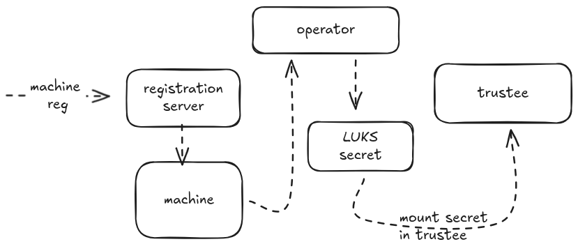
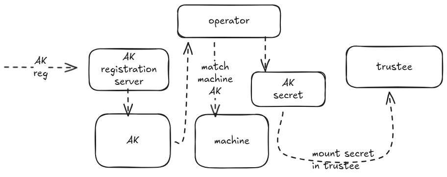

# Trusted Execution Cluster Operator Architecture

## Overview

This document describes the architecture of the Trusted Execution Cluster Operator, a Kubernetes operator written in Rust that manages the lifecycle of confidential computing nodes in a cluster. The operator coordinates machine registration, attestation key management, secret provisioning, and Trustee integration to enable trusted execution environments with TPM-based attestation.

The operator follows the Kubernetes operator pattern and is built using the [kube-rs](https://github.com/kube-rs/kube) library for Kubernetes API interactions.

## Key Components

The operator consists of several interconnected components:

1. **Registration Server**: HTTP service that handles initial machine registration and Ignition configuration delivery. Deployed in the *registration server*.
2. **AttestationKey Controller**: Manages attestation key registration and approval. Deployed in the *register-ak* pod.
3. **Trustee Integration**: Updates Trustee deployment with secrets and attestation keys for node verification. Part of the *operator* pod.
4. **Machine Controller**: Reconciles Machine custom resources representing individual nodes. Part of the *operator* pod
5. **Secret Management**: Generates and manages LUKS. encryption keys and attestation key secrets. Part of the *operator* pod.
6. **Attestation Server and KBS**: [Trustee](https://github.com/confidential-containers/trustee) deployment handle the attestation request, the reference values and secrets.
7. **Reference Values calculation**: calculate the reference values provided by the approved images.

## Architecture Components

### Registration Server Deployment

The operator deploys a registration server in the cluster that serves as the entrypoint for new machines joining the trusted cluster.

#### Registration Server Responsibilities

1. **Ignition Configuration Delivery**: Serves Ignition snippets containing LUKS/Clevis pin configuration when machines perform merge requests during first boot
2. **UUID Generation**: Generates unique identifiers for each registering machine
3. **Machine Object Creation**: Creates Machine custom resources in Kubernetes for each registered node

The registration flow is initiated when a node boots with an initial Ignition configuration containing a merge directive pointing to the registration service endpoint (e.g., `http://register-server:8000/ignitioni-clevis-pin-trustee`).

A machine can be also manually registered by the admin, but then the Ignition produced by the operator, needs to be configured manually in the upcoming machine.

### Machine Custom Resource

The Machine CRD represents an individual node/machine in the cluster and serves as the central coordination point for the node's lifecycle.

#### Machine Spec

The Machine object includes:

- **ID**: Unique identifier (UUID) for the machine

The machine is unique and an internal representation of an existing node for the operator.

#### Machine Lifecycle

1. **Creation**: Created by the registration server when a node performs its first Ignition merge request
2. **Reconciliation**: The operator watches for new Machine objects and triggers provisioning workflows
3. **Association**: Linked with AttestationKey objects for TOFU (Trust On First Use) validation

### Secret Generation and Trustee Update Flow

When the operator detects a new Machine object, it automatically provisions secrets and updates the Trustee deployment to enable attestation-based secret retrieval.

#### Secret Provisioning Process

- Creates Kubernetes owner reference linking the secret to the Machine object
  - Ensures proper garbage collection when Machine is deleted
- Generates a LUKS encryption key for the node
- Creates a Kubernetes Secret containing the LUKS key
- Secret is namespaced and linked to the specific Machine object
- Updates the Trustee deployment to include the new secret
- Adds the secret as a volume mount in the Trustee pod spec
- **Triggers Trustee pod restart** to reload the updated secret and volume configuration
- When a machine is deleted, the secret is removed from the Trustee deployement   which triggers a further pod restart.

### Attestation Key Registration

The operator implements a comprehensive attestation key (AK) registration system based on TOFU model. For detailed information about the attestation key provisioning process, see the [Attestation Key Provisioning Design Document](attestation_key_provisioning.md).

#### Registration Flow Integration

The AK registration is coordinated with Machine registration:

**During First Boot (handled by Ignition)**
1. Ignition checks if `/var/tpm/ak.pub` exists
2. If not present, generates a new AK in the TPM
3. Contacts the operator's AK registration endpoint (e.g., `https://attestation-key-register:8001/register-ak`)
4. Submits the AK public key in PEM format along with platform information

**Operator Processing**
1. **AK Registration Service**: Receives and stores the AK public key
2. **Machine Matching**: Associates the AK with the corresponding Machine object based on registration correlation. If no Machine machine exist, the AK isn't approved
3. **AK Approval**: When a matching Machine exists, the AK is automatically approved
4. **Secret Creation**: Creates a Kubernetes Secret containing the AK public key
5. **Trustee Integration**: Updates Trustee deployment with the registered AK via `trustee::update_attestation_keys()`

**Trustee Pod Restart**
- The Trustee deployment is updated with the new AK secret
- Triggers a pod restart to load the new attestation key
- After restart, Trustee can verify attestation reports signed by the registered AK
- At machine deletion, the AK is also garbage collected and removed from the Trustee deployment.

### Calculation of the reference values

The calculation of the reference values is covered in details in [reference-values](docs/design/reference-values.md). 

The result of the operation is stored in the configmaps *image-pcrs*, and then mounted in the Trustee deployment as reference value repository. This configmap is unique and multiple approved images and reference values are included here.

### Trustee deployment

The Trustee deployment is the core of the attestation and secret release. The deployment of Trustee is a single pod, it uses the builtin [attestation server configuration](https://github.com/confidential-containers/trustee/blob/main/kbs/docs/config.md#attestation-configuration) option. 

Configured by the operator, it use the *confimaps*:
* attestation-policy, for controlling which values need to be evaluated for the attestation. 
* trustee-datam which contains the reference values, the resource policy and the kbs configuration.

The secrets for the LUKS key and the trusted Attestation Key are added when the machine or the AK are registered. This causes the restart of the trustee pod since the deployment is patched with the new set of secrets.
